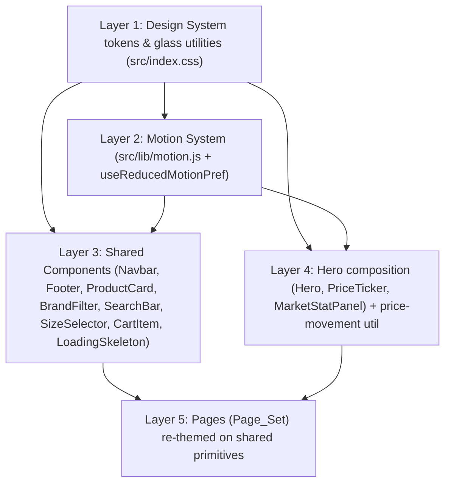
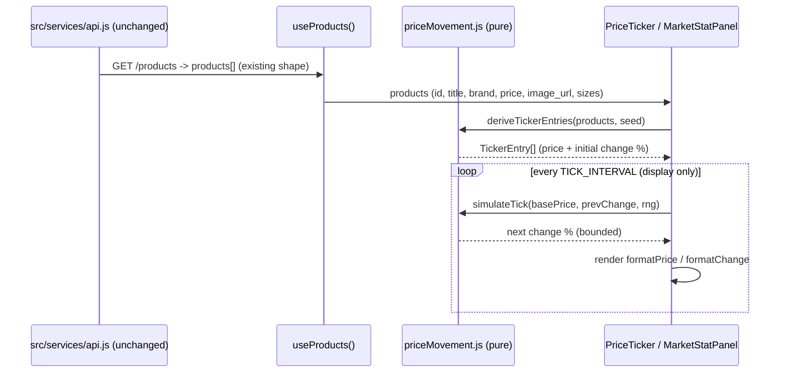

# Design Document

## Overview

This design specifies a frontend-only visual redesign of the KICKS sneaker e-commerce React application. It replaces the current neon-green dark theme with an iOS-inspired glassmorphism design language on a dark glass surface, swaps the neon-green accent (`#39ff14`) for an **electric-blue** accent, and restructures the experience to emulate a StockX / GOAT–style marketplace (data-aware grids, bid/ask-style statistics, and a live-pricing visual treatment). The centerpiece is a redesigned Hero section built around a spotlit featured sneaker layered over a glass market-stats panel, accompanied by a live market-style `Price_Ticker`.

The redesign is implemented entirely within the `frontend` directory. The backend, the HTTP API contract, and the request/response data shapes consumed via `src/services/api.js` are unchanged (Requirement 7). Because the backend exposes no live-pricing endpoint, the "live market" feeling is produced by a **client-side, presentation-only price-movement simulation** derived from existing product data — it never mutates persisted data or alters API calls (Requirements 2.3, 7.3, 8.4).

### Design Goals

| Goal | Requirements |
| --- | --- |
| One centralized, token-driven iOS glass design system in `src/index.css` | 1.1–1.7 |
| Replace every neon-green accent token/utility with an electric-blue accent | 1.5, 1.6, 8.5 |
| A distinctive spotlight-sneaker + live price ticker Hero | 2.1–2.7, 8.3, 8.4 |
| Reusable, reduced-motion-aware Framer Motion system | 3.1–3.5, 6.2 |
| Consistent glass styling, marketplace info density, and shared product card across every page | 4.1–4.5, 8.1, 8.2 |
| Responsive, accessible (contrast, focus, alt text, 44px targets, keyboard activation) | 5.1–5.5, 6.1–6.5 |
| Strictly frontend; API contract preserved | 7.1–7.4 |

### Existing Stack (unchanged)

React 19, Vite 8, Tailwind CSS v4 (`@theme`/`@utility` in `src/index.css`), Framer Motion v12, React Router v7, react-hot-toast, react-icons, axios. No new heavy dependencies are introduced. Framer Motion v12 already exports `useReducedMotion` and `MotionConfig`, which are used for the reduced-motion strategy rather than adding a library.

### Research Notes

- **Framer Motion reduced motion**: Framer Motion v12 provides a built-in `useReducedMotion()` hook (reads `prefers-reduced-motion`) and a `<MotionConfig reducedMotion="user">` provider that automatically disables transform/layout animations app-wide while preserving opacity. This is leveraged directly so reduced-motion handling is centralized rather than reimplemented (Requirements 3.4, 6.2).
- **Tailwind v4 `@theme`**: Custom properties declared under `@theme` auto-generate utilities. `--color-accent` generates `bg-accent` / `text-accent` / `border-accent`; `--radius-*` generates `rounded-*`; `--shadow-*` generates `shadow-*`. Blur radii and the glass surfaces remain hand-authored `@utility` rules because `backdrop-filter` is not produced from a single token.
- **`backdrop-filter` support**: All evergreen target browsers support `backdrop-filter` (Safari requires the `-webkit-` prefix, which the Tailwind/Vite pipeline emits). A `@supports not (backdrop-filter: blur(1px))` fallback supplies an opaque background so text contrast is preserved where blur is unavailable (Requirement 1.7).
- **StockX / GOAT reference**: The reference aesthetic is characterized by dense, data-aware product tiles (brand eyebrow, name, last-sale/price, bid/ask, movement), a neutral dark canvas, and a single saturated accent. We adapt this to the KICKS dark glass theme using the electric-blue accent instead of the reference brands' colors (Requirements 8.1, 8.2, 8.5).

## Architecture

### Layering and Sequencing

The redesign is delivered in dependency order so that each layer builds on a stable one beneath it:



1. **Design System first** — tokens and glass/accent utilities in `src/index.css`. Everything downstream consumes these. (Requirement 1)
2. **Motion System second** — shared Framer Motion variants and the reduced-motion gate. (Requirement 3)
3. **Shared components third** — re-themed primitives used by every page. (Requirement 4)
4. **Hero + price ticker fourth** — depends on tokens, motion, and a new pure price-movement utility. (Requirements 2, 8)
5. **Pages last** — each page in the `Page_Set` is re-skinned onto the now-stable primitives. (Requirement 4)

### Module Map (new and modified)

| Path | Type | Responsibility | Requirements |
| --- | --- | --- | --- |
| `src/index.css` | modified | Design system tokens, glass utilities, accent migration, reduced-motion media query, backdrop-filter fallback | 1.1–1.7, 3.4, 6.1, 6.2 |
| `src/lib/motion.js` | new | Shared Framer Motion variant definitions + `getMotionVariants(reduced)` resolver (pure) | 3.1–3.5, 2.4, 2.7 |
| `src/hooks/useReducedMotionPref.js` | new | Thin wrapper over Framer `useReducedMotion()` returning a boolean | 3.4, 6.2 |
| `src/lib/priceMovement.js` | new | Pure utilities: `formatPrice`, `formatChange`, `simulateTick`, `deriveTickerEntries` | 2.3, 8.4, 7.3 |
| `src/components/Hero.jsx` | new (extracted from Home) | Spotlight sneaker + glass `MarketStatPanel` + CTA | 2.1, 2.2, 2.5, 2.6, 5.5, 8.3 |
| `src/components/PriceTicker.jsx` | new | Market-style marquee of featured sneakers with price + movement | 2.3, 2.7, 8.4 |
| `src/components/MarketStatPanel.jsx` | new | Bid/ask-style glass stat panel behind the hero sneaker | 2.2, 8.1 |
| `src/App.jsx` | modified | Wrap app in `<MotionConfig reducedMotion="user">`; restyle toaster to electric blue | 3.4, 6.2, 1.6 |
| `src/layouts/MainLayout.jsx` | modified | Page-transition variants sourced from motion system | 3.3 |
| `src/components/*` | modified | Apply glass surfaces + accent + 44px targets + focus rings | 1.3, 4.1–4.5, 5.4, 6.3 |
| `src/pages/*` (Page_Set) | modified | Re-theme onto shared primitives, marketplace info density | 4.1–4.5, 8.1 |

No file outside `frontend/` is touched, and `src/services/api.js`, `src/hooks/useProducts.js`, and the context providers keep their existing request/response handling (Requirements 7.1, 7.2, 7.4).

### Data Flow for the Live-Pricing Illusion



The simulation lives only in component state. It reads the unchanged product fields and never writes back to the API or persisted data, satisfying the backend-preservation constraint while delivering the reference design's live-pricing treatment (Requirements 7.1–7.3, 8.4).

## Design System

The design system is the single source of truth for all visual values, declared in `src/index.css` using Tailwind v4 `@theme` tokens and `@utility` rules (Requirements 1.1–1.4). Every panel, card, nav bar, and modal consumes these utilities rather than ad-hoc inline values (Requirement 1.3).

### 1. Color Tokens

```css
@theme {
  /* Dark canvas & surfaces (retained, slightly tuned) */
  --color-brand-bg: #0a0a0a;
  --color-brand-surface: #121214;
  --color-brand-surface-card: #1a1a1d;
  --color-brand-surface-hover: #232327;
  --color-brand-muted: #737373;

  /* Electric-blue accent scale (REPLACES neon green #39ff14) */
  --color-accent: #0a84ff;          /* primary electric blue */
  --color-accent-hover: #339dff;    /* lighter hover state */
  --color-accent-strong: #0060df;   /* deep electric blue for gradients/pressed */
  --color-accent-dim: rgba(10, 132, 255, 0.15);   /* tint fills (replaces brand-neon-dim) */
  --color-accent-glow: rgba(10, 132, 255, 0.45);  /* glow/shadow color */

  /* Market status colors (status-only, NOT the brand accent) */
  --color-market-up: #32d74b;       /* iOS green — price up */
  --color-market-down: #ff453a;     /* iOS red — price down */
}
```

**Accent migration (Requirement 1.5, 1.6):** the `--color-brand-neon` and `--color-brand-neon-dim` tokens are removed. The token name moves from `brand-neon` to `accent`, so utility usages migrate `bg-brand-neon → bg-accent`, `text-brand-neon → text-accent`, `border-brand-neon → border-accent`, and `bg-brand-neon/NN → bg-accent/NN`. After migration, no source file references `#39ff14`, `brand-neon`, or `rgba(57, 255, 20, …)`. Market up/down greens/reds are intentionally distinct status colors and are never used as the interactive accent.

### 2. Glass Surface Utilities

```css
@utility glass-card {
  background-color: rgba(20, 20, 20, 0.7);
  backdrop-filter: blur(16px);
  -webkit-backdrop-filter: blur(16px);
  border: 1px solid rgba(255, 255, 255, 0.05);
}
@utility glass-nav {
  background-color: rgba(10, 10, 10, 0.75);
  backdrop-filter: blur(20px);
  -webkit-backdrop-filter: blur(20px);
  border-bottom: 1px solid rgba(255, 255, 255, 0.05);
}
@utility ios-glass {
  background-color: rgba(255, 255, 255, 0.02);
  backdrop-filter: blur(28px) saturate(180%);
  -webkit-backdrop-filter: blur(28px) saturate(180%);
  border: 1px solid rgba(255, 255, 255, 0.08);
  box-shadow: 0 8px 32px 0 rgba(0, 0, 0, 0.3);
}
@utility ios-glass-heavy {
  background-color: rgba(10, 10, 10, 0.45);
  backdrop-filter: blur(36px) saturate(200%);
  -webkit-backdrop-filter: blur(36px) saturate(200%);
  border: 1px solid rgba(255, 255, 255, 0.06);
  box-shadow: 0 12px 40px 0 rgba(0, 0, 0, 0.5);
}
```

These four utilities cover every translucent surface in the app (Requirement 1.2, 1.3). Blur radii are standardized: `16px` (light/card), `20px` (nav), `28px` (default glass), `36px` (heavy/modal).

### 3. Backdrop-Filter Fallback (Requirement 1.7)

When `backdrop-filter` is unsupported, an opaque background is substituted so body text keeps ≥ 4.5:1 contrast (Requirement 6.1):

```css
@supports not ((backdrop-filter: blur(1px)) or (-webkit-backdrop-filter: blur(1px))) {
  .glass-card     { background-color: #161616; }
  .glass-nav      { background-color: #0d0d0d; }
  .ios-glass      { background-color: #161616; }
  .ios-glass-heavy{ background-color: #0d0d0d; }
}
```

### 4. Corner Radius Tokens (Requirement 1.4)

```css
@theme {
  --radius-ios-sm: 14px;   /* inputs, pills' inner controls */
  --radius-ios: 24px;      /* cards, panels (rounded-ios) */
  --radius-ios-lg: 32px;   /* hero, large feature surfaces (rounded-ios-lg) */
}
```

Existing `@utility ios-curve` (24px) and `ios-curve-lg` (32px) are retained as aliases for backward compatibility during migration, then components standardize on `rounded-ios` / `rounded-ios-lg`. Pills use `rounded-full`.

### 5. Spacing Scale

Tailwind's default 4px-based spacing scale is used. Two semantic section rhythm conventions are standardized: section vertical padding `py-16`/`py-20`, and content gutter `px-4 sm:px-6 lg:px-8` with `max-w-7xl mx-auto` containers (matching current pages so the redesign is non-disruptive).

### 6. Typography Scale

Font family stays `'Inter', system-ui, -apple-system, sans-serif`.

| Role | Classes | Usage |
| --- | --- | --- |
| Display | `text-4xl sm:text-6xl font-black tracking-tighter leading-[0.95]` | Hero headline |
| H2 | `text-2xl sm:text-3xl font-black uppercase tracking-tight` | Section titles |
| H3 / card title | `text-sm font-semibold tracking-tight` | Product names |
| Body | `text-sm text-neutral-300 leading-relaxed` | Paragraphs |
| Eyebrow / label | `text-[10px] sm:text-xs font-black tracking-widest uppercase text-accent` | Section eyebrows, tags |
| Numeric / price | `font-extrabold tabular-nums` | Prices, ticker, market stats |

`tabular-nums` is mandated for all price and movement figures so the ticker does not jitter as digits change (Requirement 8.4).

### 7. Shadow & Glow Tokens

```css
@theme {
  --shadow-glass: 0 8px 32px rgba(0, 0, 0, 0.3);
  --shadow-glass-lg: 0 12px 40px rgba(0, 0, 0, 0.5);
}
```

Accent glow utilities migrate from green to electric blue:

```css
@utility accent-glow {            /* replaces neon-glow */
  box-shadow: 0 0 20px rgba(10, 132, 255, 0.25);
}
@utility accent-text {            /* replaces neon-text */
  text-shadow: 0 0 8px rgba(10, 132, 255, 0.4);
}
@utility ios-glow {               /* recolored to electric blue */
  box-shadow: 0 0 40px rgba(10, 132, 255, 0.12);
}
```

**Scrollbar** thumb hover recolors to the accent (Requirement 1.6):

```css
::-webkit-scrollbar-thumb:hover { background: #0a84ff; }
```

**`text-gradient`** keeps its white→gray treatment for headlines; a new `text-gradient-accent` (electric-blue → cyan) is added for accent-emphasis words in the hero:

```css
.text-gradient-accent {
  background: linear-gradient(135deg, #0a84ff 0%, #5ac8fa 100%);
  -webkit-background-clip: text;
  background-clip: text;
  -webkit-text-fill-color: transparent;
}
```

### 8. Motion Timing Tokens

```css
@theme {
  --motion-fast: 120ms;   /* hover state begins ≤100–120ms (Req 3.1) */
  --motion-base: 300ms;   /* standard transitions */
  --motion-slow: 500ms;   /* feedback animations complete ≤500ms (Req 3.2) */
  --ease-ios: cubic-bezier(0.22, 1, 0.36, 1);  /* easeOutExpo-like */
}
```

These mirror the JS motion tokens in `src/lib/motion.js` so CSS keyframes and Framer Motion share one timing vocabulary (Requirement 3.5).

### 9. Reduced-Motion Strategy (Requirements 3.4, 6.2)

Two coordinated mechanisms:

1. **CSS** — a global media query neutralizes the decorative keyframe animations (`marquee-scroll`, `float`, `fade-slide-in`, `dot-pulse`, `progress-fill`) so they render their final state without looping:

```css
@media (prefers-reduced-motion: reduce) {
  *, *::before, *::after {
    animation-duration: 0.001ms !important;
    animation-iteration-count: 1 !important;
    transition-duration: 0.001ms !important;
    scroll-behavior: auto !important;
  }
  .marquee-track { animation: none !important; transform: none !important; }
  .animate-float { animation: none !important; }
}
```

2. **JavaScript** — `<MotionConfig reducedMotion="user">` in `App.jsx` makes every Framer Motion component honor the OS preference, and the shared `getMotionVariants(reduced)` resolver returns final-state-only variants when reduced. The `Price_Ticker` shows all entries statically (no marquee translate) under reduced motion (Requirement 2.7).

## Motion System

A single module, `src/lib/motion.js`, defines all reusable Framer Motion configurations so timing is never redefined per component (Requirement 3.5).

### Shared Variants

```js
// src/lib/motion.js
export const EASE_IOS = [0.22, 1, 0.36, 1];

export const DURATION = { fast: 0.12, base: 0.3, slow: 0.5, hero: 0.8 };

// Entrance (fade + rise) — used by sections, cards, panels
export const fadeUp = {
  hidden: { opacity: 0, y: 24 },
  visible: { opacity: 1, y: 0, transition: { duration: DURATION.slow, ease: EASE_IOS } },
};

// Stagger container for grids/lists
export const staggerContainer = {
  hidden: { opacity: 0 },
  visible: { opacity: 1, transition: { staggerChildren: 0.08 } },
};

// Hover / tap micro-interactions (Req 3.1, 3.2)
export const hoverLift = { scale: 1.02, transition: { duration: DURATION.fast, ease: EASE_IOS } };
export const tapPress = { scale: 0.97, transition: { duration: DURATION.fast } };

// Hero entrance (completes ≤1200ms — Req 2.4)
export const heroReveal = {
  hidden: { opacity: 0, x: -50 },
  visible: { opacity: 1, x: 0, transition: { duration: DURATION.hero, ease: EASE_IOS } },
};

// Page transition (Req 3.3)
export const pageTransition = {
  initial: { opacity: 0, y: 6 },
  animate: { opacity: 1, y: 0 },
  exit: { opacity: 0, y: -6 },
  transition: { duration: 0.18, ease: 'easeOut' },
};

// Reduced-motion final-state variants (no transform, instant)
export const REDUCED = {
  hidden: { opacity: 1 },
  visible: { opacity: 1, transition: { duration: 0 } },
};
```

### Reduced-Motion Resolver (pure, testable)

```js
// getMotionVariants(reduced) -> returns either the animated variant or the
// final-state-only variant. Pure function; unit/property tested.
export function getMotionVariants(variant, reduced) {
  return reduced ? REDUCED : variant;
}
```

```js
// src/hooks/useReducedMotionPref.js
import { useReducedMotion } from 'framer-motion';
export function useReducedMotionPref() {
  return useReducedMotion() === true; // boolean, drives getMotionVariants(...)
}
```

Components import variants from `motion.js` and gate them through `getMotionVariants` using the hook's boolean. `MainLayout.jsx` uses `pageTransition` for route changes (Requirement 3.3). Hover/tap use Framer's `whileHover={hoverLift}` / `whileTap={tapPress}`, which `MotionConfig reducedMotion="user"` automatically suppresses (Requirements 3.1, 3.2, 3.4).

## Components and Interfaces

### Hero (`src/components/Hero.jsx`) — Requirements 2, 8.3

Composition (left/right split on desktop, stacked on mobile):

- **Left column**: eyebrow ("Live Market"), display headline with an accent gradient word, subheading, and primary CTA `Link to="/products"` (Requirements 2.1, 2.6). CTA uses `bg-accent text-black` + `accent-glow` on hover and a 44px+ height.
- **Right column**: the spotlit, angled featured sneaker (`hero_sneaker.png`) with a radial accent spotlight behind it and a soft floor shadow. The sneaker sits **layered over** the `MarketStatPanel` glass info panel (Requirement 2.2). Alt text is descriptive (Requirement 6.4).
- **Below / overlapping**: the `PriceTicker` strip (Requirement 2.3).

Props: none required; consumes `useProducts()` for featured items. Entrance uses `heroReveal` and completes within 1200ms (Requirement 2.4). Under reduced motion the panel and ticker render their final state (Requirement 2.7). The headline and CTA never clip across breakpoints (Requirement 5.5).

### MarketStatPanel (`src/components/MarketStatPanel.jsx`) — Requirements 2.2, 8.1

A `ios-glass-heavy rounded-ios-lg` panel showing bid/ask-style stats for the featured sneaker, derived from the product's existing `price` via `priceMovement.js`:

| Field | Source |
| --- | --- |
| Last Sale | `formatPrice(product.price)` |
| Bid (highest) | `formatPrice(price * 0.96)` (presentation-only) |
| Ask (lowest) | `formatPrice(price * 1.08)` (presentation-only) |
| 24h change | `formatChange(changePct)` colored `market-up`/`market-down` |

Interface: `<MarketStatPanel product={product} changePct={number} />`. No API calls.

### PriceTicker (`src/components/PriceTicker.jsx`) — Requirements 2.3, 2.7, 8.4

A horizontal marquee of featured sneakers, each cell showing brand, name, `formatPrice`, and a colored `formatChange` with an up/down chevron. Built on the existing `.marquee-track` keyframe for the scroll and an internal interval that calls `simulateTick` to nudge each entry's change value (display-only).

Interface: `<PriceTicker products={Product[]} intervalMs={3000} />`.

Behavior:
- Derives entries via `deriveTickerEntries(products, seed)`; if products is empty it renders nothing (graceful empty state).
- `useReducedMotionPref()` true ⇒ no marquee translate and no interval updates; entries render once in final state (Requirements 2.7, 3.4).
- Each ticker cell is a `Link` to that product, with a visible focus ring and keyboard activation (Requirements 6.3, 6.5).

### Re-themed Shared Components

| Component | Changes | Requirements |
| --- | --- | --- |
| **Navbar** | `ios-glass` bar (kept), all `brand-neon` → `accent`; cart badge `bg-accent`; profile dropdown to `ios-glass`; fix missing `toast` import used in `handleLogout`; ensure icon buttons are ≥44px and have focus rings | 1.3, 1.6, 4.2, 5.4, 6.3 |
| **Footer** | `glass`/surface styling, accent hovers, focus rings on links; newsletter input uses Design_System input style | 1.6, 4.2, 4.3 |
| **ProductCard** | Shared marketplace card: brand eyebrow, name, **last-sale price + movement chip** (bid/ask density), accent quick-add; `hoverLift`/`tapPress` from motion system; `rounded-ios`; alt text from `product.title` | 4.5, 8.1, 3.1, 3.2, 6.4 |
| **BrandFilter** | Active pill `bg-accent text-black` + accent glow; 44px tall pills; focus rings | 1.6, 5.4, 6.3 |
| **SearchBar** | Glass/surface input, `focus:border-accent focus:ring-accent`; fix icon class typos (`h-5 h-5`→`h-5 w-5`, `h-4 h-4`→`h-4 w-4`) | 1.6, 4.3, 6.3 |
| **SizeSelector** | `ios-glass-heavy` modal, accent selected size, focus rings, Esc/overlay close; 44px targets | 1.6, 5.4, 6.3, 6.5 |
| **CartItem** | Surface card → glass, accent brand tag, 44px qty controls, accent focus rings | 1.6, 4.1, 5.4 |
| **LoadingSkeleton** | Recolor shimmer to neutral glass tones (no green); `rounded-ios` to match cards | 1.6, 4.5 |

### Page-Level Redesign (`Page_Set`) — Requirement 4

All pages keep their existing data flow, hooks, routes, and `api.js` usage; only presentation changes.

| Page | Redesign focus | Requirements |
| --- | --- | --- |
| **Home** | Extract `Hero` + `PriceTicker`; recolor ambient orbs to accent; marquee, carousel, brand tabs, trust badges, CTA banner all migrate to accent + glass | 2.x, 4.1, 4.5, 8.x |
| **Products** | Marketplace grid header with result count, glass filter bar, shared `ProductCard`; accent states | 4.1, 4.5, 8.1 |
| **ProductDetail** | Glass product stage, bid/ask `MarketStatPanel`-style stats block, accent size grid + add-to-cart; alt text | 4.1, 4.5, 6.4, 8.1 |
| **Cart** | Glass list using re-themed `CartItem`, glass order-summary panel | 4.1, 4.3 |
| **Checkout** | Design_System input styling, glass summary, accent submit | 4.1, 4.3 |
| **Login / Signup / VerifyEmail / ForgotPassword / ResetPassword** | `glass-card` form container, Design_System inputs, accent CTAs + focus rings; recolor glow orbs | 4.1, 4.3, 6.3 |
| **Orders** | Glass order cards, accent status chips, marketplace info density | 4.1 |
| **Profile** | Glass panels, Design_System inputs, accent | 4.1, 4.3 |
| **Admin** | Glass tables/cards, accent primary actions, Design_System typography; consistent with rest of Page_Set | 4.4 |

## Data Models

All models below are **UI/presentation-only**. They are derived from the existing, unchanged product response shape and never alter the API contract (Requirements 7.1–7.3).

### Product (existing API shape — consumed, not modified)

```ts
// As returned by GET /products via src/services/api.js — unchanged
interface Product {
  id: number;
  title: string;
  brand?: string;
  price?: number | string;
  image_url?: string;
  sizes?: string | string[];   // JSON-ish string or array (parsed in UI as today)
  description?: string;
}
```

### TickerEntry (new, derived)

```ts
interface TickerEntry {
  id: number;          // == Product.id (no fabricated ids)
  title: string;       // == Product.title
  brand: string;       // Product.brand || 'Sneakers'
  basePrice: number;   // numeric Product.price (NaN-safe -> 0)
  changePct: number;   // simulated movement %, presentation-only, bounded
}
```

### MarketStat (new, derived for MarketStatPanel)

```ts
interface MarketStat {
  lastSale: string;    // formatPrice(basePrice)
  bid: string;         // formatPrice(basePrice * 0.96)
  ask: string;         // formatPrice(basePrice * 1.08)
  changeLabel: string; // formatChange(changePct)
  direction: 'up' | 'down' | 'flat';
}
```

### Design Tokens (authoritative reference)

The token tables in the Design System section above are the authoritative model; components reference token-generated utilities (`bg-accent`, `rounded-ios`, `shadow-glass`, etc.) rather than literal values (Requirement 1.3).

### MotionVariants (new)

```ts
interface MotionVariant { hidden: object; visible: object; }
// Exposed: fadeUp, staggerContainer, heroReveal, pageTransition, REDUCED
// Resolver: getMotionVariants(variant: MotionVariant, reduced: boolean): MotionVariant
```

### price-movement utility surface (`src/lib/priceMovement.js`)

```ts
function formatPrice(value: number): string;        // -> "$1,234" (no decimals, grouped)
function formatChange(changePct: number): string;   // -> "+2.34%" | "-1.10%" (sign + 2 decimals)
function simulateTick(prevChange: number, rng?: () => number): number; // bounded next change %
function deriveTickerEntries(products: Product[], seed?: number): TickerEntry[]; // subset, identity-preserving
```

Bounds: `simulateTick` keeps the returned change within `[-MAX_PCT, +MAX_PCT]` (e.g. `MAX_PCT = 12`). `deriveTickerEntries` returns at most `MAX_TICKER` entries (e.g. 12) and only entries whose `id`/`title` come from the input list.

## Correctness Properties

*A property is a characteristic or behavior that should hold true across all valid executions of a system — essentially, a formal statement about what the system should do. Properties serve as the bridge between human-readable specifications and machine-verifiable correctness guarantees.*

**Scope note:** This feature is predominantly a visual/CSS redesign. The vast majority of acceptance criteria (glass surfaces, accent recolor, layout, responsiveness, focus styling, contrast) are verified by build/lint, snapshot/render assertions, and manual responsive/keyboard checks — property-based testing does not apply to pure visual CSS. PBT applies only to the small set of **pure logic** modules introduced by this design: the reduced-motion variant resolver (`getMotionVariants`), the price-movement utilities (`priceMovement.js`), and the alt-text invariant on `ProductCard`. The properties below cover exactly that logic.

### Property 1: Reduced-motion resolver yields a non-looping final state

*For any* motion variant and the boolean `reduced = true`, `getMotionVariants(variant, reduced)` returns the final-state variant whose `visible` state has `opacity === 1`, no transform offset, and a zero-duration (non-looping) transition; and *for any* variant with `reduced = false`, it returns the input variant unchanged.

**Validates: Requirements 2.7, 3.4, 6.2**

### Property 2: Ticker derivation preserves product identity and is bounded

*For any* array of products in the existing API `Product` shape (including `price` as a number or numeric string, and `sizes` as a string or array), `deriveTickerEntries(products)` does not throw, returns at most `MAX_TICKER` entries, and every returned entry's `id` and `title` originate from an element of the input array (no fabricated products), with a finite numeric `basePrice` and a `changePct` within `[-MAX_PCT, +MAX_PCT]`.

**Validates: Requirements 2.3, 7.3, 8.4**

### Property 3: Price/change formatting and movement simulation invariants

*For any* finite numeric input, `formatChange(changePct)` produces a string beginning with `+` when the input is ≥ 0 and `-` when the input is < 0, and *for any* previous change value and any `rng()` result in `[0, 1)`, `simulateTick(prevChange, rng)` returns a finite value within `[-MAX_PCT, +MAX_PCT]`; and `formatPrice(value)` returns a `$`-prefixed grouped integer string for any finite non-negative input.

**Validates: Requirements 8.4, 2.3**

### Property 4: Every product image has descriptive alternative text

*For any* product with a non-empty `title`, the image rendered by `ProductCard` has a non-empty `alt` attribute derived from the product's `title`.

**Validates: Requirements 6.4**

## Error Handling

Because the redesign is presentation-only and the API layer is unchanged, error handling focuses on rendering robustness, not new network paths.

| Scenario | Handling |
| --- | --- |
| Products fail to load / empty list | Existing `useProducts` error/loading states are retained; `PriceTicker` and `MarketStatPanel` render nothing (or a quiet placeholder) when there are no products — no crash (Requirement 2.3). |
| `product.price` is a non-numeric string or missing | `priceMovement` parses defensively (`Number(...)`, `NaN`-safe → `0`); `formatPrice` never throws and yields a stable string (Requirement 7.3). |
| `product.sizes` is a JSON-ish string vs array | Existing safe-parse logic in `ProductCard`/`ProductDetail` is preserved; derivation ignores `sizes` (Requirement 7.3). |
| `backdrop-filter` unsupported by browser | `@supports` fallback applies opaque surface backgrounds so text stays legible at ≥ 4.5:1 (Requirements 1.7, 6.1). |
| `prefers-reduced-motion: reduce` | CSS media query + `MotionConfig reducedMotion="user"` + `getMotionVariants` short-circuit all looping/transform motion to final state (Requirements 3.4, 6.2, 2.7). |
| Missing hero/product image asset | `` retains descriptive `alt`; product images fall back to the existing Unsplash placeholder URL already used in the codebase (Requirement 6.4). |
| Ticker interval after unmount | Interval cleared in a `useEffect` cleanup to avoid setting state on an unmounted component. |

## Testing Strategy

The testing approach matches a frontend visual redesign: lightweight automated checks for the small pure-logic surface, plus build/lint gates and structured manual verification for the visual layer.

### Automated — Build & Lint Gates (primary safety net)

- `npm run build` (Vite) must succeed — catches broken imports from the token/component refactor and the Hero extraction.
- `npm run lint` (ESLint) must pass — catches the existing latent bug (missing `toast` import in `Navbar.handleLogout`) and unused/incorrect JSX.
- Repo-wide assertion that **no neon-green remains**: a grep/lint check across `src/**` for `#39ff14`, `brand-neon`, and `rgba(57, 255, 20` returns zero matches (Requirements 1.6, 8.5).

### Automated — Unit & Property Tests (pure logic only)

These modules are pure and fast, so they are unit + property tested. Since the project has no test runner today, **Vitest** is added as a dev dependency (Vite-native, minimal footprint) together with **fast-check** for property-based tests and `@testing-library/react` for the two render-output assertions. Property tests run a **minimum of 100 iterations**.

| Property | Module under test | Library |
| --- | --- | --- |
| Property 1 (reduced-motion resolver) | `src/lib/motion.js` → `getMotionVariants` | fast-check |
| Property 2 (ticker derivation) | `src/lib/priceMovement.js` → `deriveTickerEntries` | fast-check |
| Property 3 (format/simulate invariants) | `src/lib/priceMovement.js` → `formatPrice`/`formatChange`/`simulateTick` | fast-check |
| Property 4 (alt text) | `src/components/ProductCard.jsx` render | fast-check + Testing Library |

Each property test is tagged with a comment referencing the design property, e.g.:

```js
// Feature: ios-ui-redesign, Property 3: Price/change formatting and movement simulation invariants
test.prop([fc.double({ min: -1000, max: 1000, noNaN: true })])('formatChange sign matches input sign', (pct) => {
  const s = formatChange(pct);
  expect(s.startsWith(pct >= 0 ? '+' : '-')).toBe(true);
});
```

Example-based unit tests complement the properties for concrete cases: Hero renders headline/subheading/CTA with `href="/products"` (Requirements 2.1, 2.6); CTA click navigates to Products (2.6); `PriceTicker` renders nothing for an empty product list; reduced-motion render shows static ticker (2.7).

### Manual — Visual & Accessibility Verification (the visual layer)

A structured manual checklist is the appropriate tool for the CSS/layout criteria that automation cannot meaningfully cover:

- **Responsive** (Requirements 5.1–5.5): verify mobile/tablet/desktop layouts in dev tools; confirm single-column mobile nav/grids, no horizontal overflow, hero headline + CTA never clip.
- **Touch targets** (Requirement 5.4): spot-measure interactive controls ≥ 44×44px at mobile widths.
- **Contrast** (Requirement 6.1): run a contrast checker on body text over each glass surface and over the opaque `@supports` fallback; confirm ≥ 4.5:1.
- **backdrop-filter fallback** (Requirement 1.7): emulate unsupported `backdrop-filter`; confirm opaque surfaces and legible text.
- **Keyboard & focus** (Requirements 6.3, 6.5): tab through Navbar, ProductCard, BrandFilter, SizeSelector, forms; confirm visible focus rings and that Enter/Space activate the same action as a click.
- **Reduced motion** (Requirements 2.7, 3.4, 6.2): enable OS "reduce motion"; confirm hero, marquee, ticker, and orbs render final state without looping.
- **Accent migration & consistency** (Requirements 1.5, 1.6, 4.1–4.5, 8.5): walk every page in the `Page_Set`; confirm electric-blue accent, glass surfaces, shared product card, and no neon-green anywhere.
- **Alt text** (Requirement 6.4): confirm hero sneaker and product images expose descriptive alternatives.

### Why PBT does not apply broadly here

Per the design's testing guidance, property-based testing is inappropriate for UI rendering, layout, CSS tokens, and visual styling — there is no meaningful "for all inputs X, P(X)" over a stylesheet or a static composition. Those criteria are covered by snapshot/render assertions and manual checks. PBT is reserved for the genuinely pure, input-varying logic (motion resolver, price-movement utilities, alt-text derivation) captured in Properties 1–4 above.
